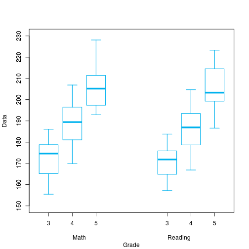
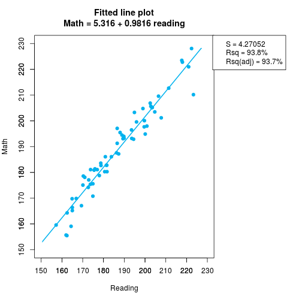
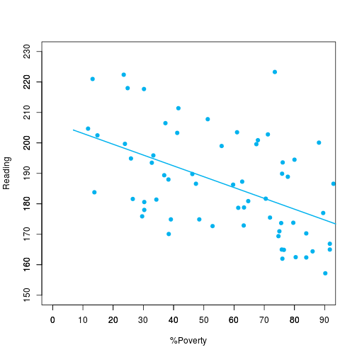
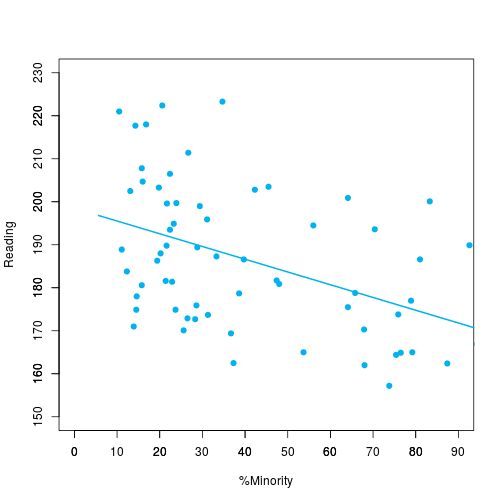
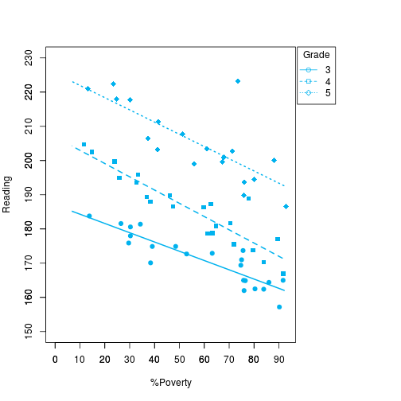
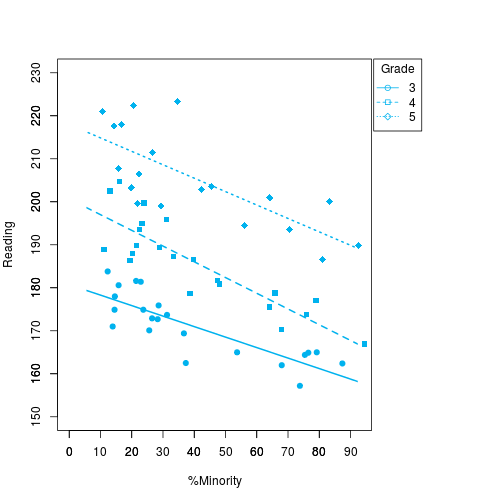

Inicialmente um boxplot que mostra os dados agrupados nas matérias de Matemática e Leitura para o terceiro quarto e quinto grau:

```r
#Graph:1 - Boxplot
third_grade = read.csv("../input/third_grade.csv")
fourth_grade = read.csv("../input/fourth_grade.csv")
fifth_grade = read.csv("../input/fifth_grade.csv", na.strings="-")

print(third_grade)
```

```
##    School  Math Reading X.Minority X.Poverty   N
## 1       1 166.4   165.0       79.2      91.7  48
## 2       2 159.6   157.2       73.8      90.2  61
## 3       3 159.1   164.4       75.4      86.0  57
## 4       4 155.5   162.4       87.4      83.9  87
## 5       5 164.3   162.5       37.3      80.4  51
## 6       6 169.8   164.9       76.5      76.5  68
## 7       7 155.7   162.0       68.0      76.0  75
## 8       8 165.2   165.0       53.7      75.8  95
## 9       9 175.4   173.7       31.3      75.6  45
## 10     10 178.1   171.0       13.9      75.0  36
## 11     11 167.1   169.4       36.7      74.7  79
## 12     12 177.1   172.9       26.5      63.2  68
## 13     13 174.2   172.7       28.3      52.9 191
## 14     14 175.6   174.9       23.7      48.5  97
## 15     15 170.8   174.9       14.5      39.1 110
## 16     16 175.1   170.1       25.6      38.4  86
## 17     17 182.8   181.4       22.9      34.3  70
## 18     18 180.3   180.6       15.8      30.3 165
## 19     19 178.8   178.0       14.6      30.3  89
## 20     20 181.4   175.9       28.6      29.6  98
## 21     21 182.8   181.6       21.4      26.5  98
## 22     22 186.1   183.8       12.3      13.8 130
```

```r
print(fourth_grade)
```

```
##    School  Math Reading X.Minority X.Poverty   N
## 1       1 181.1   177.0       78.9      89.5  38
## 2       2 181.1   173.8       75.9      79.6  54
## 3       3 180.9   175.5       64.1      71.9  64
## 4       4 169.9   166.9       94.4      91.7  72
## 5       5 183.6   178.7       38.6      61.4  57
## 6       6 178.6   170.3       67.9      83.9  56
## 7       7 182.7   178.8       65.8      63.3  79
## 8       8 186.1   180.9       48.0      64.7 102
## 9       9 187.2   187.3       33.3      62.7  51
## 10     10 194.5   188.9       11.1      77.8  36
## 11     11 180.3   181.7       47.4      70.5  78
## 12     12 187.6   186.3       19.4      59.7  72
## 13     13 194.0   189.8       21.6      46.2 171
## 14     14 193.1   189.4       28.8      36.9 111
## 15     15 195.5   188.0       20.2      38.3  94
## 16     16 191.3   186.6       39.7      47.4  78
## 17     17 200.1   199.7       23.9      23.9  67
## 18     18 196.5   193.5       22.4      32.8 116
## 19     19 203.5   204.7       16.0      11.7  94
## 20     20 199.6   195.9       31.1      33.3  90
## 21     21 203.3   194.9       23.3      25.9 116
## 22     22 206.9   202.5       13.1      14.8 122
```

```r
print(fifth_grade)
```

```
##    School  Math Reading X.Minority X.Poverty   N
## 1       1 197.1   186.6       81.0      92.9  42
## 2       2 194.9   200.1       83.3      88.1  42
## 3       3 192.9   194.5       56.0      80.0  50
## 4       4 193.3   189.9       92.6      75.9  54
## 5       5 197.7   199.6       21.7      67.4  46
## 6       6 193.2   193.6       70.4      76.1  71
## 7       7 198.0   200.9       64.1      67.9  78
## 8       8 205.2   203.5       45.5      61.0  77
## 9       9 210.2   223.3       34.7      73.5  49
## 10     10 204.8   199.0       29.4      55.9  34
## 11     11 205.7   202.8       42.3      71.2  52
## 12     12 201.2   207.8       15.8      51.3  76
## 13     13 205.2   203.3       19.8      41.2 131
## 14     14 212.7   211.4       26.7      41.6 101
## 15     15    NA      NA         NA        NA  NA
## 16     16 209.6   206.5       22.4      37.3  67
## 17     17 223.5   217.7       14.3      30.2  63
## 18     18 222.8   218.0       16.8      24.8 137
## 19     19    NA      NA         NA        NA  NA
## 20     20 228.1   222.4       20.6      23.5 102
## 21     21 221.0   221.0       10.5      13.2 114
## 22     22    NA      NA         NA        NA  NA
```

```r
boxplot(third_grade$Math, fourth_grade$Math, fifth_grade$Math, third_grade$Reading, 
	fourth_grade$Reading, fifth_grade$Reading,names = c("3","4", "5", "3","4", "5"),
	xlab="Math\t\t\t\t\t\t\tReading", ylab="Data", ylim=c(150,230), at=c(1,2,3,6,7,8),
	border="deepskyblue2", lty=1, lwd=1.5)
axis(2,at=c(150,160,170,180,190,200,210,220,230))
title(xlab = "Grade", line = 4)
```



Depois plotamos um gráfico que mostra a correlação entre as variáveis matemática e leitura. Podemos observar uma alta correlação entre os dados.

```r
#Graph:2 - Math vs Reading
third_grade = read.csv("../input/third_grade.csv")
fourth_grade = read.csv("../input/fourth_grade.csv")
fifth_grade = read.csv("../input/fifth_grade.csv", na.strings="-")

math_array <- c(third_grade$Math, fourth_grade$Math, fifth_grade$Math)
reading_array <- c(third_grade$Reading, fourth_grade$Reading, fifth_grade$Reading)

max_math <- max(math_array, na.rm=TRUE)
max_reading <- max(reading_array, na.rm=TRUE)

min_math <- min(math_array, na.rm=TRUE)
min_reading <- min(reading_array, na.rm=TRUE)

scale <- c(150,160,170,180,190,200,210,220,230)
min_max <- c(150,230)

#This line is used to use legend out of plot area.
par(mar=c(5.1, 4, 4.1, 10.2), xpd=TRUE)

#Plot data, insert title, define axis range and set the legend
plot(reading_array, math_array, xlim=min_max, ylim=min_max, xlab="Reading", 
	ylab="Math", col="deepskyblue2", pch=19)
title(main="Fitted line plot\nMath = 5.316 + 0.9816 reading")
axis(1, at=scale)
axis(2, at=scale)
legend("topright", inset=c(-0.4,0), 
	legend=c("S = 4.27052","Rsq = 93.8%", "Rsq(adj) = 93.7%"))

#Create a square do delimit plot area.
clip(min_math-5, max_math+5, min_reading-5, max_reading+5)
#Create a line
linear_regression <- lm(math_array~reading_array)
abline(linear_regression$coefficients[1], linear_regression$coefficients[2], 
	col="deepskyblue2", lwd=2)
```



Já que matemática e leitura são altamente correlatas, então foi escolhido o atributo leitura para verificar a correlação com as outros atributos (pobreza e minoria) ambos em porcentagem.

```r
#Graph:3 - Reading vs X.Poverty
third_grade = read.csv("../input/third_grade.csv")
fourth_grade = read.csv("../input/fourth_grade.csv")
fifth_grade = read.csv("../input/fifth_grade.csv", na.strings="-")

poverty_array <- c(third_grade$X.Poverty, fourth_grade$X.Poverty, fifth_grade$X.Poverty)
reading_array <- c(third_grade$Reading, fourth_grade$Reading, fifth_grade$Reading)

max_poverty <- max(poverty_array, na.rm=TRUE)
max_reading <- max(reading_array, na.rm=TRUE)

min_poverty <- min(poverty_array, na.rm=TRUE)
min_reading <- min(reading_array, na.rm=TRUE)

x_scale <- c(0,10,20,30,40,50,60,70,80,90)
y_scale <- c(150,160,170,180,190,200,210,220,230)

min_max_x <- c(0,90)
min_max_y <- c(150,230)

#Plot data, insert title, define axis range and set the legend
plot(poverty_array, reading_array, xlim=min_max_x, ylim=min_max_y, xlab="%Poverty", 
	ylab="Reading", col="deepskyblue2", pch=19)

axis(1, at=x_scale)
axis(2, at=y_scale)

#Create a square do delimit plot area.
clip(min_poverty-5, max_poverty+5, min_reading-5, max_reading+5)
#Create a line
linear_regression <- lm(reading_array~poverty_array)
abline(linear_regression$coefficients[1], linear_regression$coefficients[2], 
	col="deepskyblue2", lwd=2)
```




```r
#Graph:4 - Reading vs X.Minority
third_grade = read.csv("../input/third_grade.csv")
fourth_grade = read.csv("../input/fourth_grade.csv")
fifth_grade = read.csv("../input/fifth_grade.csv", na.strings="-")

minority_array <- c(third_grade$X.Minority, fourth_grade$X.Minority, fifth_grade$X.Minority)
reading_array <- c(third_grade$Reading, fourth_grade$Reading, fifth_grade$Reading)

max_minority <- max(minority_array, na.rm=TRUE)
max_reading <- max(reading_array, na.rm=TRUE)

min_minority <- min(minority_array, na.rm=TRUE)
min_reading <- min(reading_array, na.rm=TRUE)

x_scale <- c(0,10,20,30,40,50,60,70,80,90)
y_scale <- c(150,160,170,180,190,200,210,220,230)

min_max_x <- c(0,90)
min_max_y <- c(150,230)

#Plot data, insert title, define axis range and set the legend
plot(minority_array, reading_array, xlim=min_max_x, ylim=min_max_y, xlab="%Minority", 
	ylab="Reading", col="deepskyblue2", pch=19)

axis(1, at=x_scale)
axis(2, at=y_scale)

#Create a square do delimit plot area.
clip(min_minority-5, max_minority+5, min_reading-5, max_reading+5)
#Create a line
linear_regression <- lm(reading_array~minority_array)
abline(linear_regression$coefficients[1], linear_regression$coefficients[2], 
	col="deepskyblue2", lwd=2)
```



Podemos ver que há uma tendência das variáveis serem inversamente correlatas, no entanto, não é tão precisa. Dessa forma, vamos traçar a correlação por grau de escolaridade entre essas variáveis.

```r
#Graph:5 - Reading vs X.Poverty vs Grade
third_grade = read.csv("../input/third_grade.csv")
fourth_grade = read.csv("../input/fourth_grade.csv")
fifth_grade = read.csv("../input/fifth_grade.csv", na.strings="-")

x_scale <- c(0,10,20,30,40,50,60,70,80,90)
y_scale <- c(150,160,170,180,190,200,210,220,230)

min_max_x <- c(0,93)
min_max_y <- c(150,230)

#This line is used to use legend out of plot area.
par(mar=c(5.1, 4, 4.1, 9.2), xpd=TRUE)

#Plot data, insert title, define axis range and set the legend
plot(third_grade$X.Poverty, third_grade$Reading, xlim=min_max_x, ylim=min_max_y, 
	xlab="%Poverty", ylab="Reading", col="deepskyblue2", pch=19)
axis(1, at=x_scale)
axis(2, at=y_scale)
legend("topright", inset=c(-0.16,0), pch=c(21:23),
	legend=c(3,4,5), lty=1:3, col="deepskyblue2", title="Grade")

#Plot another points (4-th and 5-th grade)
points(fourth_grade$X.Poverty, fourth_grade$Reading, col="deepskyblue2",
	pch=15)

points(fifth_grade$X.Poverty, fifth_grade$Reading, col="deepskyblue2",
	pch=18, cex=1.3)


#Create a square do delimit plot area.
clip(min_poverty-5, 92, min_reading-5, 230)
#Create lines
linear_regression <- lm(third_grade$Reading ~ third_grade$X.Poverty)
abline(linear_regression$coefficients[1], linear_regression$coefficients[2], 
	col="deepskyblue2", lwd=2)

linear_regression <- lm(fourth_grade$Reading ~ fourth_grade$X.Poverty)
abline(linear_regression$coefficients[1], linear_regression$coefficients[2], 
	col="deepskyblue2", lwd=2, lty=2)

linear_regression <- lm(fifth_grade$Reading ~ fifth_grade$X.Poverty)
abline(linear_regression$coefficients[1], linear_regression$coefficients[2], 
	col="deepskyblue2", lwd=2, lty=3)
```




```r
#Graph:6 - Reading vs X.Minority vs Grade
third_grade = read.csv("../input/third_grade.csv")
fourth_grade = read.csv("../input/fourth_grade.csv")
fifth_grade = read.csv("../input/fifth_grade.csv", na.strings="-")

x_scale <- c(0,10,20,30,40,50,60,70,80,90)
y_scale <- c(150,160,170,180,190,200,210,220,230)

min_max_x <- c(0,93)
min_max_y <- c(150,230)

#This line is used to use legend out of plot area.
par(mar=c(5.1, 4, 4.1, 9.2), xpd=TRUE)

#Plot data, insert title, define axis range and set the legend
plot(third_grade$X.Minority, third_grade$Reading, xlim=min_max_x, ylim=min_max_y, 
	xlab="%Minority", ylab="Reading", col="deepskyblue2", pch=19)
axis(1, at=x_scale)
axis(2, at=y_scale)
legend("topright", inset=c(-0.16,0), pch=c(21:23),
	legend=c(3,4,5), lty=1:3, col="deepskyblue2", title="Grade")

#Plot another points (4-th and 5-th grade)
points(fourth_grade$X.Minority, fourth_grade$Reading, col="deepskyblue2",
	pch=15)

points(fifth_grade$X.Minority, fifth_grade$Reading, col="deepskyblue2",
	pch=18, cex=1.3)


#Create a square do delimit plot area.
clip(min_minority-5, 92, min_reading-5, 230)
#Create lines
linear_regression <- lm(third_grade$Reading ~ third_grade$X.Minority)
abline(linear_regression$coefficients[1], linear_regression$coefficients[2], 
	col="deepskyblue2", lwd=2)

linear_regression <- lm(fourth_grade$Reading ~ fourth_grade$X.Minority)
abline(linear_regression$coefficients[1], linear_regression$coefficients[2], 
	col="deepskyblue2", lwd=2, lty=2)

linear_regression <- lm(fifth_grade$Reading ~ fifth_grade$X.Minority)
abline(linear_regression$coefficients[1], linear_regression$coefficients[2], 
	col="deepskyblue2", lwd=2, lty=3)
```



O próximo passo é montar uma matriz de correlações entre a variável de leitura para as variáveis de minoria e pobreza para cada grau.

```r
#Tab:1 - Correlation
third_grade = read.csv("../input/third_grade.csv")
fourth_grade = read.csv("../input/fourth_grade.csv")
fifth_grade = read.csv("../input/fifth_grade.csv", na.strings="-")

minority_3 <- cor(third_grade$X.Minority, third_grade$Reading, 
	method="pearson")
minority_4 <- cor(fourth_grade$X.Minority, fourth_grade$Reading, 
	method="pearson")
minority_5 <- cor(fifth_grade$X.Minority, fifth_grade$Reading, 
	method="pearson", use = "complete.obs")

poverty_3 <- cor(third_grade$X.Poverty, third_grade$Reading, 
	method="pearson")
poverty_4 <- cor(fourth_grade$X.Poverty, fourth_grade$Reading, 
	method="pearson")
poverty_5 <- cor(fifth_grade$X.Poverty, fifth_grade$Reading, 
	method="pearson", use = "complete.obs")

cor_between <- c('Reading scores and', '%minority', '%poverty')
third_grade <- c('', format(round(minority_3, 2), nsmall = 2), 
	format(round(poverty_3, 2), nsmall = 2))
fourth_grade <- c('', format(round(minority_4, 2), nsmall = 2), 
	format(round(poverty_4, 2), nsmall = 2))
fifth_grade <- c('', format(round(minority_5, 2), nsmall = 2), 
	format(round(poverty_5, 2), nsmall = 2))

cor_data_frame <- data.frame(cor_between, third_grade, fourth_grade, fifth_grade)
colnames(cor_data_frame) <- c('Correlation between', '3rd Grade', '4th Grade', '5th Grade')

print(cor_data_frame)
```

```
##   Correlation between 3rd Grade 4th Grade 5th Grade
## 1  Reading scores and                              
## 2           %minority     -0.83     -0.87     -0.75
## 3            %poverty     -0.89     -0.92     -0.76
```
